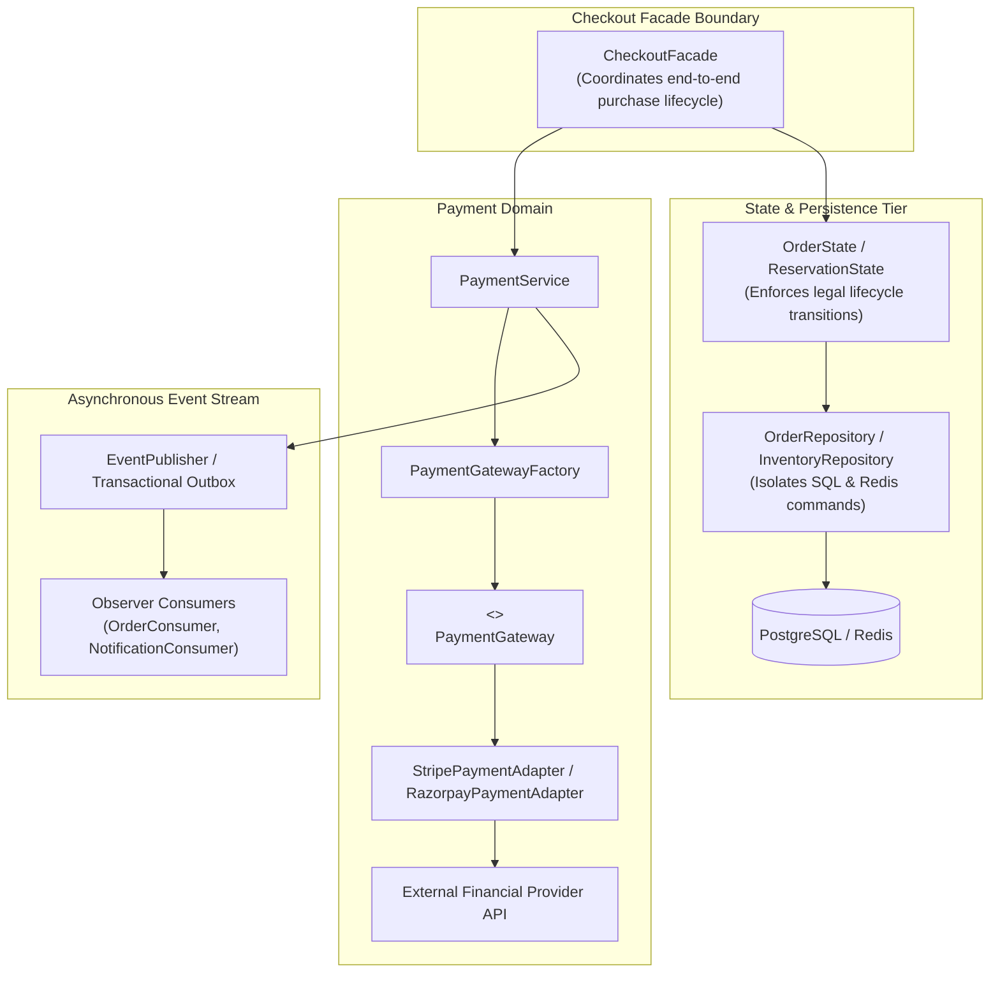

# ==============================================================================
# SALESTORM ARFA: Design Patterns Implementation Guide
# Deliverable 14 | Section 14 of Master Architecture Specification
# ==============================================================================

## 1. Design Pattern Mapping Matrix

| Pattern | SALESTORM Location | Problem Solved | Trade-off / Cost |
| :--- | :--- | :--- | :--- |
| **Strategy** | `PricingStrategy`, `PaymentGatewayStrategy`, `DeliveryStrategy` | Interchangeable business algorithms without branching logic. | Additional class abstractions and interface types. |
| **Factory** | `PaymentGatewayFactory` | Creates provider-specific implementations (Stripe, Razorpay) dynamically based on currency/region. | Factory logic requires strict configuration governance. |
| **State** | `ReservationState`, `OrderState` | Explicit lifecycle state transitions (`AVAILABLE` $\rightarrow$ `RESERVED` $\rightarrow$ `CONFIRMED` / `EXPIRED`). | Increased state transition classes and validation logic. |
| **Adapter** | `PaymentGatewayAdapter`, `ShippingAdapter` | Normalizes external vendor payloads into standard internal domain contracts. | Provider schema differences must be continuously maintained. |
| **Observer / Event-Driven** | Domain events (`PaymentSucceeded`), Kafka consumers, Notification consumers | Decouples event producers from consumers for high throughput and resilience. | Eventual consistency and asynchronous operational complexity. |
| **Repository** | `InventoryRepository`, `ReservationRepository`, `PaymentRepository`, `OrderRepository` | Separates domain business logic from physical persistence mechanisms (Redis / PostgreSQL). | Additional abstraction layer overhead. |
| **Facade** | `CheckoutFacade` | Simplifies the complex cross-domain orchestration boundary across inventory, payment, and orders. | Can become an anti-pattern God Object if responsibilities are uncontrolled. |
| **Circuit Breaker** | `Resilience4j` on payment & shipping external HTTP calls | Prevents cascading thread pool failure when external payment providers experience latency spikes. | Introduces temporary fail-fast behaviour during provider degradation. |

---

## 2. Pattern Interaction Architecture



---

## 3. Extensibility Proofs

### A. Introducing a New Payment Gateway (e.g. Adyen / PayPal)
To introduce a new payment provider:
1. Implement the `PaymentGateway` interface:
   ```python
   class AdyenPaymentAdapter(PaymentGateway):
       def authorize(self, intent: PaymentIntent) -> AuthResult: ...
       def capture(self, transaction_id: str) -> CaptureResult: ...
   ```
2. Register the adapter in `PaymentGatewayFactory`.
3. **No changes are required to `CheckoutFacade` or `OrderService`**, preserving the Open-Closed Principle (OCP).

### B. Introducing a Dynamic Flash-Sale Pricing Strategy
To introduce a tiered flash-sale pricing algorithm (e.g. early-bird discount):
1. Implement `PricingStrategy`:
   ```python
   class EarlyBirdPricingStrategy(PricingStrategy):
       def calculate_price(self, base_price_cents: int, remaining_stock: int) -> int:
           if remaining_stock > 80:
               return int(base_price_cents * 0.8) # 20% discount
           return base_price_cents
   ```
2. Inject the strategy into `CheckoutFacade` without modifying order confirmation pipelines.

### C. Introducing a Third-Party Fulfillment Partner (e.g. FedEx / DHL)
1. Implement `ShippingAdapter` matching the domain shipping port.
2. The `OrderCreated` Kafka event is consumed by the new shipment adapter without modifying the core `OrderService`.
