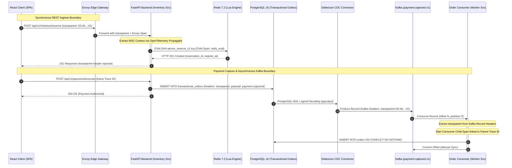

# ==============================================================================
# SALESTORM ARFA: Distributed Tracing & Observability Architecture
# Document: 09_Security_Observability/distributed_tracing_metrics.md
# Tier-1 Enterprise Specification | OpenTelemetry v1.30+ | Prometheus | Alertmanager
# ==============================================================================

## 1. Executive Summary & Telemetry Topology

In a flash-sale distributed architecture handling **10,000 concurrent contenders vying for 100 inventory units**, sub-millisecond observability is the difference between smooth zero-overselling execution and catastrophic cascade failure.

SALESTORM ARFA implements a unified telemetry topology built on:
1. **OpenTelemetry (OTel) Distributed Tracing**: Continuous, context-propagated distributed traces using the **W3C TraceContext** standard across both synchronous REST boundaries and asynchronous Kafka/CDC message boundaries.
2. **Prometheus High-Resolution Metrics**: High-cardinality multi-dimensional histograms, counters, and gauges recording inventory contention, outbox pipeline lag, and crash recovery duration.
3. **Alertmanager Production Rules**: Real-time evaluation of Service Level Objectives (SLOs), triggering automated paging for P99 latency regressions ($>15\,\text{ms}$) and Dead-Letter Queue (DLQ) non-zero accumulations ($>0$).

---

## 2. OpenTelemetry W3C TraceContext Propagation

### A. Trace Context Standard & Wire Format
Every transaction entering SALESTORM carries or generates a **W3C TraceContext** (RFC 8421 / W3C Recommendation):

```
traceparent: 00-4bf92f3577b34da6a3ce929d0e0e4736-00f067aa0ba902b7-01
              │  │                                │                │
              │  └─ Trace ID (32 hex characters)  └─ Parent Span ID└─ Trace Flags
              │     (128-bit global transaction)     (64-bit hop)     (01 = Sampled)
              └──── Version (00 = Current W3C standard)
```

Additionally, `tracestate` carries vendor-specific and priority tenant routing keys:
```
tracestate: salestorm=tier:vip,priority:p0,region:us-east-1
```

---

### B. End-to-End Distributed Trace Lifecycle (Sync & Async)



---

### C. Synchronous REST Boundary Propagation (FastAPI & Envoy)

At the synchronous ingress boundary, the FastAPI ASGI application extracts the incoming HTTP W3C `traceparent`, binds it to the Python context, and injects child spans around internal Redis operations:

```python
# apps/backend/telemetry/tracer.py
from opentelemetry import trace
from opentelemetry.trace.propagation.tracecontext import TraceContextTextMapPropagator
from opentelemetry.sdk.trace import TracerProvider
from opentelemetry.sdk.trace.export import BatchSpanProcessor
from opentelemetry.exporter.otlp.proto.grpc.trace_exporter import OTLPSpanExporter
from fastapi import Request

# Initialize Tracer Provider with OTLP Exporter
provider = TracerProvider()
processor = BatchSpanProcessor(OTLPSpanExporter(endpoint="http://otel-collector:4317"))
provider.add_span_processor(processor)
trace.set_tracer_provider(provider)
tracer = trace.get_tracer("salestorm.backend", "1.0.0")

async def extract_and_inject_trace_context(request: Request):
    """
    Extracts W3C traceparent header from incoming HTTP request carrier
    and binds current execution context to the extracted trace.
    """
    carrier = dict(request.headers)
    extracted_context = TraceContextTextMapPropagator().extract(carrier=carrier)
    return extracted_context

# Usage in FastAPI Endpoint
@app.post("/api/v1/checkout/reserve")
async def reserve_stock(request: Request, payload: ReserveRequest):
    parent_ctx = await extract_and_inject_trace_context(request)
    
    with tracer.start_as_current_span("reserve_inventory", context=parent_ctx) as span:
        span.set_attribute("salestorm.product_id", payload.product_id)
        span.set_attribute("salestorm.user_id", payload.user_id)
        
        # Redis Lua execution child span
        with tracer.start_as_current_span("redis_lua_eval") as redis_span:
            redis_span.set_attribute("db.system", "redis")
            redis_span.set_attribute("db.statement", "EVALSHA atomic_reserve_v1.lua")
            result = await redis_client.evalsha(LUA_HASH, 3, ...)
            
        span.set_attribute("salestorm.reservation_status", result["status"])
        return result
```

---

### D. Asynchronous Kafka Boundary Propagation (Outbox & Consumer)

The core challenge in distributed event architectures is **loss of trace context across message queues**. SALESTORM bridges this boundary by serializing the active OpenTelemetry context into Kafka record headers.

#### 1. Outbox Event Writer (Context Injection)
When writing to the PostgreSQL `transactional_outbox`, the active W3C trace context is injected into the event metadata:

```python
# Context Injection into Event Metadata
from opentelemetry.trace.propagation.tracecontext import TraceContextTextMapPropagator

def build_outbox_event(aggregate_id: str, event_type: str, payload: dict) -> dict:
    carrier = {}
    # Inject current span's W3C context into dictionary carrier
    TraceContextTextMapPropagator().inject(carrier)
    
    return {
        "event_id": str(uuid.uuid4()),
        "aggregate_id": aggregate_id,
        "event_type": event_type,
        "payload": payload,
        "trace_headers": {
            "traceparent": carrier.get("traceparent", ""),
            "tracestate": carrier.get("tracestate", "")
        }
    }
```

Debezium captures this change from PostgreSQL WAL and copies `trace_headers` directly into native **Kafka Record Headers**.

#### 2. Order Consumer Worker (Context Extraction & Span Linking)
When `apps/workers/order_consumer.py` reads a record from Kafka topic `payment.captured.v1`, it extracts the binary/string headers, reconstructs the parent span, and creates a linked child span:

```python
# apps/workers/order_consumer.py (OTel Trace Extraction)
from opentelemetry import trace
from opentelemetry.trace.propagation.tracecontext import TraceContextTextMapPropagator

tracer = trace.get_tracer("salestorm.order_consumer", "1.0.0")

def process_kafka_record(record):
    # 1. Parse W3C traceparent from Kafka message headers
    headers_dict = {}
    if record.headers:
        for k, v in record.headers:
            headers_dict[k] = v.decode("utf-8") if isinstance(v, bytes) else str(v)

    # 2. Extract parent OpenTelemetry Context
    extracted_context = TraceContextTextMapPropagator().extract(carrier=headers_dict)

    # 3. Create consumer span as child of the original checkout span
    with tracer.start_as_current_span(
        "order_consumer.settle_order",
        context=extracted_context,
        kind=trace.SpanKind.CONSUMER
    ) as span:
        span.set_attribute("messaging.system", "kafka")
        span.set_attribute("messaging.destination", "payment.captured.v1")
        span.set_attribute("messaging.kafka.offset", record.offset)
        span.set_attribute("messaging.kafka.partition", record.partition)
        
        # Idempotent database settlement
        settle_order_in_db(record.value)
        span.set_status(trace.StatusCode.OK)
```

**Result:** In Jaeger/Grafana Tempo, an operator viewing a single Trace ID can see the entire timeline:
1. `Client Click` (Browser, 0.0ms)
2. `Envoy Ingress` (+1.2ms)
3. `FastAPI reserve_inventory` (+2.1ms)
4. `Redis Lua atomic_reserve_v1` (+3.4ms, duration 0.6ms)
5. `FastAPI payment_capture` (+45.0ms)
6. `PostgreSQL outbox_write` (+58.2ms)
7. `Kafka publish payment.captured.v1` (+61.0ms)
8. `Order Consumer settle_order` (+75.4ms, partition 0, offset 42)
9. `PostgreSQL orders_insert` (+82.1ms)

---

## 3. Prometheus Metrics Definition Table

The following production metrics are exposed at `GET /metrics` on port 8080 (backend) and port 8085 (order consumer):

| Metric Identifier | Metric Type | Labels / Dimensions | Description | PromQL Query Expression | SLO / SLA Target |
| :--- | :--- | :--- | :--- | :--- | :--- |
| `salestorm_inventory_contention_duration_seconds` | **Histogram** | `product_id`, `status` (`success`, `exhausted`, `conflict`), `le` | Latency distribution of atomic Lua reservation script execution under concurrent contender load. | `histogram_quantile(0.99, sum(rate(salestorm_inventory_contention_duration_seconds_bucket[1m])) by (le))` | **P99 $\le 15\,\text{ms}$**<br/>**P90 $\le 5\,\text{ms}$**<br/>**P50 $\le 1.2\,\text{ms}$** |
| `salestorm_reservations_total` | **Counter** | `product_id`, `status` (`granted`, `exhausted`, `expired`) | Cumulative counter of all inventory reservation attempts and terminal lifecycle events. | `sum by (status) (rate(salestorm_reservations_total[1m]))` | **Granted: exactly 100**<br/>**Exhausted: remainder**<br/>**Expired: restocked** |
| `salestorm_kafka_outbox_lag_records` | **Gauge** | `pipeline` (`debezium_cdc`, `pg_outbox`), `topic` | Number of uncommitted or pending records in the transactional outbox waiting for Kafka transport. | `salestorm_kafka_outbox_lag_records{pipeline="pg_outbox"}` | **Lag $\le 50\,\text{records}$**<br/>(Drain time $< 500\,\text{ms}$) |
| `salestorm_order_recovery_duration_ms` | **Histogram** | `worker_id`, `trigger` (`crash_recovery`, `restart`), `le` | Elapsed duration in milliseconds to drain backlog and restore consumer consistency following simulated downstream crash. | `histogram_quantile(0.99, sum(rate(salestorm_order_recovery_duration_ms_bucket[5m])) by (le))` | **P99 $\le 3,000\,\text{ms}$**<br/>(Full recovery $< 5\text{s}$) |
| `salestorm_stock_available_gauge` | **Gauge** | `product_id` | Real-time unreserved available stock remaining in the Redis core memory cell. | `salestorm_stock_available_gauge{product_id="FLASH_SALE_LAPTOP_001"}` | **Invariant: $\ge 0$**<br/>(Alert instantly if $< 0$) |
| `salestorm_active_leases_gauge` | **Gauge** | `product_id` | Number of active 300s TTL hold leases currently registered in Redis ZSet. | `salestorm_active_leases_gauge{product_id="FLASH_SALE_LAPTOP_001"}` | **Invariant: $\le 100$** |
| `salestorm_dlq_records_total` | **Counter** | `topic`, `failure_reason` (`deserialization`, `poison_pill`, `db_deadlock`) | Total number of messages rejected and routed to Dead-Letter Queue topics (`*.dlq`). | `sum(rate(salestorm_dlq_records_total[1m]))` | **Strictly $0$**<br/>(Any accumulation = P0 Alert) |

---

## 4. Production Alertmanager Rules Specification

The following `PrometheusRule` custom resource and Alertmanager configuration are deployed in the SALESTORM monitoring namespace.

### A. Alerting Rules (`prometheus_alerts_salestorm.yaml`)

```yaml
apiVersion: monitoring.coreos.com/v1
kind: PrometheusRule
metadata:
  name: salestorm-flash-sale-alerts
  namespace: monitoring
  labels:
    role: alert-rules
    app.kubernetes.io/part-of: salestorm-arfa
spec:
  groups:
  - name: salestorm.sli.alerts
    rules:

    # --------------------------------------------------------------------------
    # 1. P99 INVENTORY CONTENTION LATENCY BREACH (>15ms)
    # --------------------------------------------------------------------------
    - alert: SalestormInventoryContentionP99LatencyBreach
      expr: >
        histogram_quantile(
          0.99,
          sum(rate(salestorm_inventory_contention_duration_seconds_bucket[1m])) by (le)
        ) > 0.015
      for: 30s
      labels:
        severity: critical
        tier: tier-1
        team: sre-core-flashsale
      annotations:
        summary: "P99 Inventory Contention Latency Breached 15ms SLA"
        description: >
          The 99th percentile Redis Lua atomic reservation execution latency is 
          {{ $value | humanizeDuration }} (threshold: 0.015s / 15ms) for the past 30 seconds.
          Risk of connection pool exhaustion and client HTTP 504 timeouts.
        runbook_url: "https://ops.salestorm.internal/runbooks/contention-latency-spike"
        dashboard_url: "https://grafana.salestorm.internal/d/flash-sale-contention"

    # --------------------------------------------------------------------------
    # 2. DEAD-LETTER QUEUE ACCUMULATION (>0)
    # --------------------------------------------------------------------------
    - alert: SalestormDeadLetterQueueAccumulation
      expr: salestorm_dlq_records_total > 0
      for: 1m
      labels:
        severity: critical
        tier: tier-1
        team: data-platform-sre
      annotations:
        summary: "Unprocessed Messages Accumulated in Dead-Letter Queue"
        description: >
          Dead-Letter Queue has accumulated {{ $value }} unprocessable message(s) 
          across topics for >1m. Potential poison pill, schema mismatch, or payment payload corruption.
        runbook_url: "https://ops.salestorm.internal/runbooks/dlq-remediation"
        dashboard_url: "https://grafana.salestorm.internal/d/kafka-dlq-monitor"

    # --------------------------------------------------------------------------
    # 3. CRITICAL INVARIANT BREACH: NEGATIVE INVENTORY OVERSOLD
    # --------------------------------------------------------------------------
    - alert: SalestormNegativeInventoryOversoldBreach
      expr: salestorm_stock_available_gauge < 0
      for: 0s # Instant firing - zero tolerance
      labels:
        severity: disaster
        tier: tier-0
        team: executive-incident-response
      annotations:
        summary: "CATASTROPHIC INVARIANT BREACH: Negative Stock Count Detected"
        description: >
          Inventory count for SKU has fallen to {{ $value }}. The zero-overselling 
          invariant has failed! Emergency circuit breaker must engage immediately.
        runbook_url: "https://ops.salestorm.internal/runbooks/emergency-stock-freeze"
        dashboard_url: "https://grafana.salestorm.internal/d/inventory-audit"

    # --------------------------------------------------------------------------
    # 4. KAFKA TRANSACTIONAL OUTBOX LAG HIGH (>500 records)
    # --------------------------------------------------------------------------
    - alert: SalestormKafkaOutboxLagHigh
      expr: salestorm_kafka_outbox_lag_records > 500
      for: 60s
      labels:
        severity: warning
        tier: tier-1
        team: data-platform-sre
      annotations:
        summary: "Transactional Outbox CDC Pipeline Backlogged (>500 records)"
        description: >
          Debezium CDC connector has {{ $value }} records pending replication from PostgreSQL 
          transactional_outbox to Kafka topic payment.captured.v1 for >60s.
        runbook_url: "https://ops.salestorm.internal/runbooks/cdc-lag-remediation"

    # --------------------------------------------------------------------------
    # 5. ORDER CRASH RECOVERY DURATION ELEVATED (>5000ms)
    # --------------------------------------------------------------------------
    - alert: SalestormOrderRecoveryDurationHigh
      expr: >
        histogram_quantile(
          0.99,
          sum(rate(salestorm_order_recovery_duration_ms_bucket[5m])) by (le)
        ) > 5000
      for: 2m
      labels:
        severity: warning
        tier: tier-2
        team: sre-core-flashsale
      annotations:
        summary: "Order Worker Crash Recovery Catch-Up Exceeded 5,000ms"
        description: >
          Consumer recovery drain duration P99 is {{ $value }}ms, exceeding the 5,000ms SLA. 
          Downstream order settlement backlog is draining sub-optimally.
        runbook_url: "https://ops.salestorm.internal/runbooks/worker-scale-out"
```

---

### B. Alertmanager Routing Configuration (`alertmanager.yml`)

```yaml
global:
  resolve_timeout: 5m
  pagerduty_url: "https://events.pagerduty.com/v2/enqueue"
  slack_api_url: "${SLACK_INCOMING_WEBHOOK_URL}" # Injected from Vault / K8s secret

route:
  group_by: ['alertname', 'namespace', 'tier']
  group_wait: 10s
  group_interval: 30s
  repeat_interval: 1h
  receiver: 'slack-sre-feed'
  routes:
  # Tier-0 Disaster Route: Immediate PagerDuty escalation + Phone Callout
  - match:
      severity: disaster
    receiver: 'pagerduty-tier0-disaster'
    repeat_interval: 5m
    continue: true

  # Critical P99 Latency & DLQ Accumulation Route
  - match:
      severity: critical
    receiver: 'pagerduty-tier1-critical'
    repeat_interval: 15m

receivers:
- name: 'slack-sre-feed'
  slack_configs:
  - channel: '#salestorm-sre-alerts'
    send_resolved: true
    title: '{{ template "slack.salestorm.title" . }}'
    text: '{{ template "slack.salestorm.text" . }}'

- name: 'pagerduty-tier1-critical'
  pagerduty_configs:
  - service_key: 'pd-salestorm-tier1-secret-key'
    severity: 'error'
    send_resolved: true

- name: 'pagerduty-tier0-disaster'
  pagerduty_configs:
  - service_key: 'pd-salestorm-tier0-exec-key'
    severity: 'critical'
    send_resolved: true

inhibit_rules:
# Inhibit warning alerts if a critical disaster alert is already firing
- source_match:
    severity: 'disaster'
  target_match:
    severity: 'warning'
  equal: ['namespace']
```

---

## 5. SRE Automated Runbooks & Incident Remediation

### Runbook A: P99 Latency Breach (>15ms)
1. **Diagnosis**:
   * Inspect Redis CPU utilization: `redis-cli -h $REDIS_HOST info cpu`. If single core exceeds 90%, check slowlog: `SLOWLOG GET 10`.
   * Check connection count: `redis-cli -h $REDIS_HOST info clients`. If `connected_clients > 10000`, increase FastAPI connection pooling reuse.
2. **Mitigation**:
   * Scale Envoy ingress rate-limiting to temporarily shed non-reserve traffic (`GET /catalog` requests).
   * Activate client-side Exponential Backoff Jitter (max wait: 250ms).

### Runbook B: DLQ Accumulation (>0)
1. **Diagnosis**:
   * Inspect DLQ consumer logs: `kubectl logs -n production -l app=order-consumer --tail=100 | grep DLQ`.
   * Sample message from Kafka DLQ:
     ```bash
     kafka-console-consumer --bootstrap-server kafka:9092 \
       --topic payment.captured.v1.dlq --from-beginning --max-messages 1
     ```
2. **Mitigation**:
   * Verify PostgreSQL schema migrations: ensure `orders` table has no unmigrated foreign key or nullability constraints.
   * Replay DLQ messages via remediation job once root cause is patched:
     ```bash
     python apps/workers/remediation_dlq_replay.py --topic payment.captured.v1.dlq
     ```
